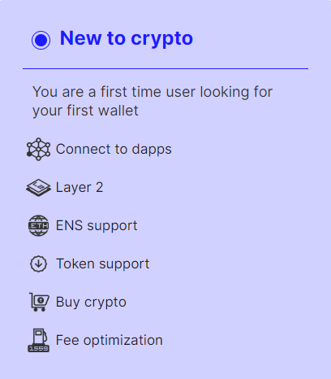

# How to create an Ethereum account

Anyone can create an Ethereum account at any time, for free. There are several ways, but the easiest and most common way is to use an app known as a wallet. Wallets create and secure the [keys](/glossary/#key) that enable you to use Ethereum. You can use your wallet to send transactions, check your token balances and connect to apps built on Ethereum, such as token exchanges, games, [NFT](/glossary/#nft) marketplaces and more. Some "web2" apps now allow you to sign in with Ethereum too.

Unlike opening a new account with a company, creating an Ethereum account is done freely, privately and without requiring permission. Accounts are controlled by keys that your wallet software helps you create, and are not issued by a third party, nor stored in a central registry.

## Step 1: Choose a wallet

A wallet is an app that helps you manage your Ethereum account. It uses your keys to send and receive transactions and sign in to apps. There are dozens of different wallets to choose from—mobile, desktop, or even browser extensions.

<ButtonLink to="/wallets/find-wallet/">
  Find a wallet
</ButtonLink>

If you are new, you can select the “New to crypto” filter on the "find a wallet" page to identify wallets that should include all necessary features suitable for beginners.

There are also other profile filters to cater to your needs. These are examples of commonly used wallets - you should do your own research before trusting any software.

## Step 2: Download and install your wallet app

Once you have decided on a specific wallet, visit their official website or app store, download and install it. All of them should be free.

## Step 3: Open the app and generate or import your Ethereum account

The first time you open your new wallet you might be asked to choose between creating a new account or importing an existing one. Click on the new account creation.

## Step 4: Store your recovery phrase

Some apps will request you to save a secret 'seed phrase' (you might also see this referred to as a "recovery phrase" or a "mnemonic"). Keeping this seed phrase safe is extremely important! The seed phrase is used to generate a secret key for an account which can be used to sign and send transactions. Any person who knows the seed phrase can take control of all the accounts generated by it. Never share the seed phrase with anyone. The seed phrase should contain 12 to 24 randomly generated words (the order of the words matters).

Once you have saved your seed phrase you should see your wallet dashboard with your balance. Check out our guide: [how to use a wallet.](/guides/how-to-use-a-wallet)

  
 
<InfoBanner shouldSpaceBetween emoji=":eyes:">
  
Want to learn more?

  <ButtonLink to="/guides/">
    See our other guides
  </ButtonLink>
</InfoBanner>

## Frequently asked questions

### Are my wallet and my Ethereum account the same?

No. The wallet is a management tool that helps you to manage accounts. A single wallet might give access to several accounts, and a single account can be accessed by multiple wallets. The seed phrase is used to create accounts that are then controlled by the wallet.

You can think of the accounts as leaves on a tree that all 'grow' from a single seed phrase. Each unique seed will grow an entirely different tree of accounts.

### Can I send bitcoin to an Ethereum address, or ether to a Bitcoin address?

No, you cannot. Bitcoin and ether exist on two separate networks (i.e. different blockchains), each with their own bookkeeping models and address formats. There have been various attempts to bridge the two different networks, of which the most active one is currently [Wrapped bitcoin or WBTC](https://www.bitcoin.com/get-started/what-is-wbtc/). This is not an endorsement, as WBTC is a custodial solution (meaning a single group of people controls certain critical functions) and is provided here for informational purposes only.

### If I own an ETH address, do I own the same address on other blockchains?

You can use the same [address](/glossary/#address) on all blockchains that use similar underlying software to Ethereum (known as 'EVM-compatible'). This [list](https://chainlist.org/) will show you which blockchains you can use with the same address. Some blockchains, like Bitcoin, implement a completely separate set of network rules and you will need a different address with a different format. If you have a smart contract wallet you should check its product website for more info on which blockchains are supported.

### Is having my own wallet safer than keeping my funds on an exchange?

Having your own wallet means you take responsibility for the security of your assets. There are unfortunately many examples of failed exchanges that lost their customers' money. Owning a wallet (with a seed phrase) removes the risk associated with trusting some entity to hold your assets. However, you have to secure your own keys and avoid phishing scams, accidentally approving transactions or exposing keys, interacting with fake websites and other self-custody risks. The risks and benefits are different.

### If I lose my phone/hardware wallet, do I need to use the same wallet app again to recover the lost funds?

No, you can use a different wallet. As long as you have the seed phrase you can enter it into most wallets and they will restore your account. Be careful if you ever need to do this: it is best to make sure you are not connected to the internet when recovering your wallet so that your seed phrase is not accidentally leaked. It is often impossible to recover lost funds without the seed phrase.
