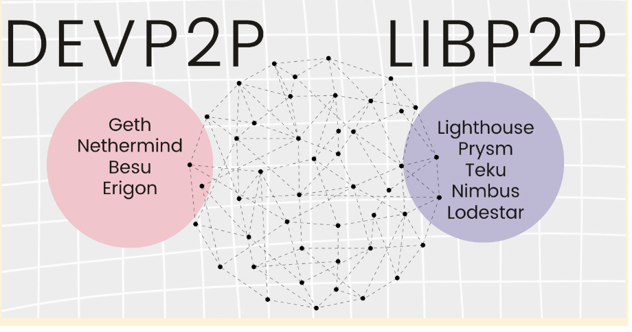

Ethereum runs on nodes. A "node" is any instance of Ethereum client software connected to other computers also running Ethereum software, forming a network. A client is an implementation of Ethereum that verifies data against the protocol rules and keeps the network secure.

Nodes have to run client software, for example, Prysm and Geth, which are vital to the operations of Ethereum.

Ethereum is a decentralized network that relies on a consensus mechanism called Proof-of-Stake (PoS) to validate and agree upon transactions and the state of the blockchain. Clients are implementations of the Ethereum protocol that enable network participants, known as validators, to contribute their computational resources to secure the network and maintain consensus.

## Limitations of the current networking design {#limitations-of-current-network-design}

Node Operators use clients to store a copy of a part or the entire blockchain and validate transactions and smart contracts. By running their nodes, users can independently verify the state of the network without relying on centralized entities.

Clients are currently developed on top of peer-to-peer technology called DevP2P and LibP2P.

The clients do a great job of running Ethereum; they must work within the design framework of devP2P and libP2P.

This means the current clients need more support in what they can do to help keep network data requirements low.

Disk space often poses a significant limitation for node operators, particularly when running full nodes or archive nodes for blockchain networks such as Ethereum. To give you an overview of the storage requirements:

For a full Geth node and a consensus client, it is advisable to have a 2TB hard drive. Geth, the Go implementation of the Ethereum protocol, typically demands more than 650GB of disk space for a snap-synced full node. Snap-sync is a synchronization method that involves downloading snapshots of the Ethereum blockchain instead of processing each block individually.

A Geth node grows by approximately 14GB per week. To optimize storage utilization, Geth offers a pruning feature that allows the node to discard older blockchain data that is no longer necessary for transaction verification. By pruning, the total storage size can be reduced back to the original 650GB.

However, it's important to note that pruning limits the node's ability to provide historical data.
Read more here: https://geth.ethereum.org/docs/getting-started/hardware-requirements
The design of DevP2P impacts users running a node in many ways:

- High CPU usage
- High hardrive requirements
- Bandwidth usage
- Sync times can be long

Running Ethereum nodes results in a high entry barrier that affects geographic and economic participation. Trying to build solutions to tackle these issues are not feasible in the current framework.

## Why is the Portal Network different? {#why-is-portal-network-different?}

Portal decided to rethink the whole design.

“What if we could build outside of these design constraints.”

Portal aims to build a decentralized peer-to-peer network that enables lightweight access to the Ethereum protocol.

Portal Network's new design aims to:

- Reduce Internet bandwidth usage
- Minimized or zero syncing
- Accessible to resource-constrained devices (<1GB ram, <100mB disk, 1CPU)
- Residential internet connection

Portal took the essential five parts of running a client that could be split up. This reduces the burden on the above, allowing users to run a node with whatever computational power they can.

Another challenge is building this in a decentralised structure; running on a centralised infrastructure would remove many of the obstacles the team is building solutions for, although this would be too much dependency which would not be a viable solution for the long term.

Helios, a Rust-based Ethereum light client, provides access to Ethereum. converts data from an untrusted centralized provider; while this project overcomes some challenges, it needs to be fully decentralised.

Portal Network also made the design choice to build three clients from day one.

Having multiple independent client implementations enhances the resilience and decentralization of the Ethereum network.

If one client experiences issues or vulnerabilities, other clients can continue to operate smoothly, preventing a single point of failure. Additionally, diverse client implementations foster innovation and competition, driving improvements and reducing monoculture risk within the ecosystem.

Now you see that the best option to design a decentralised light client needed a new approach from the current infrastructure, a multi-team effort.

## Further Reading {#futher-reading}

- The Portal Network (Piper Merriam at ETHZurich).

- [Portal Network discord](https://discord.gg/6XFs56cX)

- [The Portal Network website](ethportal.net)