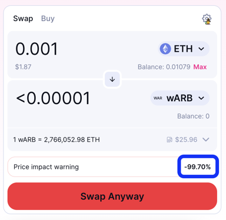

# How to identify scam tokens

This guide will teach you how to identify *scam tokens*, [ERC-20 tokens](https://ethereum.org/en/developers/docs/standards/tokens/erc-20/) that are created to mimic other tokens, typically for the sake of defrauding people. 

For example, [Arbitrum](https://arbitrum.foundation/) has a governance token, `ARB`. You can see it on [their rollup](https://arbiscan.io/token/0x912ce59144191c1204e64559fe8253a0e49e6548), or on [the Ethereum mainnet](https://etherscan.io/address/0xb50721bcf8d664c30412cfbc6cf7a15145234ad1). But somebody also created a [scam token](https://etherscan.io/token/0xb047c8032b99841713b8e3872f06cf32beb27b82) that attempts to look like a wrapped version of the legitimate `ARB`.

## How do scam tokens work?

The whole point of Ethereum is decentralization. This means that there is no central authority that can confiscate your assets or prevent you from deploying a smart contract. But it also means that scammers can deploy any smart contract they wish.

Specifically, just because Arbitrum deployed a contract that uses the symbol `ARB`, doesn't mean that other people can't also deploy a contract that uses the exact same symbol, or a similar one. And whoever writes the contract gets to set what the contract will do.

## Appearing legitimate

There are several tricks that scam token creator pull to appear legitimate. They can do those, because they write the smart contract that implements the scam token. This means it can produce any effect they want.

- **Legitimate name and symbol**. As mentioned before, ERC-20 contracts can hae the same symbol and name as other ERC-20 contracts. You cannot count on those fields for security.

- **Legitimate owners**. Scam tokens often airdrop significant balances to addresses that can be expected to be legitimate holders of the real token.

  For example, lets look at `wARB` again. [About 16% of the tokens](https://etherscan.io/token/0xb047c8032b99841713b8e3872f06cf32beb27b82?a=0x1c8db745abe3c8162119b9ef2c13864cd1fdd72f) are held by an address whose public tag is [Arbitrum Foundation: Deployer](https://etherscan.io/address/0x1c8db745abe3c8162119b9ef2c13864cd1fdd72f). This is *not* a fake address, it really is the address that [deployed the real ARB contract on Ethereum mainnet](https://etherscan.io/tx/0x242b50ab4fe9896cb0439cfe6e2321d23feede7eeceb31aa2dbb46fc06ed2670). The ERC-20 balance of an address is part of the ERC-20 contract's storage, and can be specified by the contract to be whatever it wishes.

- **Legitimate transfers**. *Legitimate owners wouldn't pay to transfer a scam token around, so if there are transfers it must be legitimate, right?* Wrong. [`Transfer` events](https://eips.ethereum.org/EIPS/eip-20#transfer-1) are emitted by the ERC-20 contract. A scammer can easily write the contract in such a way it will emit those events, with any desired source and destination, at will. 

## Scammy UI

Another trick that scammers pull is to direct users to user interfaces that entice them to sign bad transactions. For example, [this scam token](https://optimistic.etherscan.io/token/0x15992f382d8c46d667b10dc8456dc36651af1452) tried to direct users to `https://op-claim.xyz`. This probably used to host a scam, but the scammer has since then given up and stopped paying for web hosting.

## What can you trust?

How do you protect yourself? How do you know that the token you're getting is legitimate? The most important rule is **check the contract address**. Legitimate tokens come from legitimate organizations. For example, for `ARB` [you can see the legitimate addresses here](https://docs.arbitrum.foundation/deployment-addresses#token). 

Additionally, you can look at the size of liquidity pools. Scam tokens typically have tiny liquidity pools, if any, because the scammers don't want to risk real assets. For example, the `ARB` Uniswap pool holds over 300k$ as I'm writing this ([see here for the up to date value](https://info.uniswap.org/#/tokens/0xb50721bcf8d664c30412cfbc6cf7a15145234ad1)) and buying a small amount is not going to change the price:

But if I try to buy `vARB`, even a tiny purchase would change the prince by over 90%:

