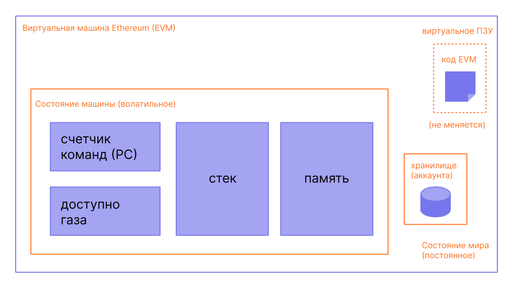
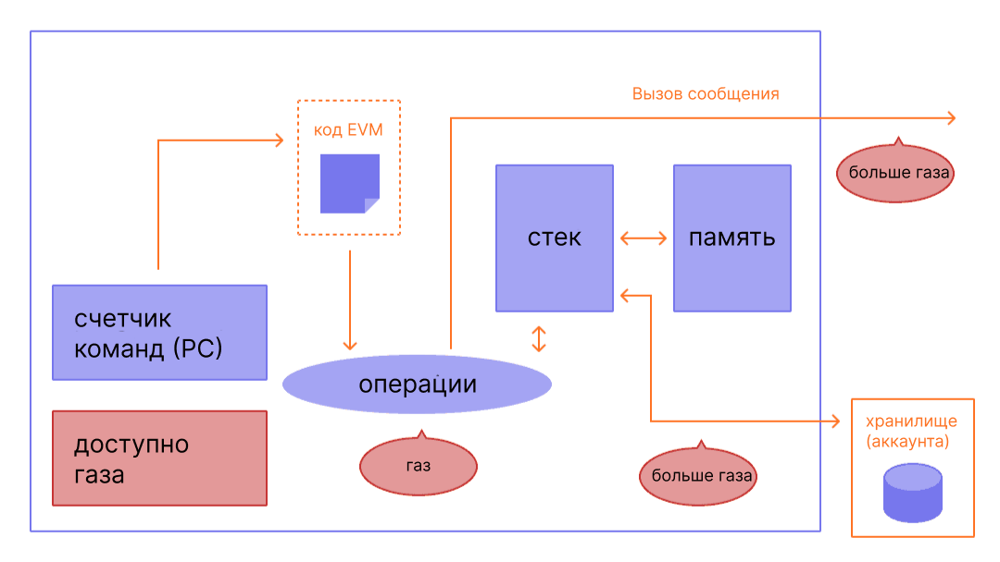

Физическую установку EVM нельзя описать также, как объекты вроде облака или океанской волны. Виртуальная машина _существует_ как единое целое благодаря тысячам компьютеров, подключенных к клиенту Ethereum.

Сам протокол Ethereum существует исключительно с целью сохранения непрерывного, бесперебойного и неизменяемого функционирования этой виртуальной машины. Это среда, в которой находятся все аккаунты и умные контракты Ethereum. При любом заданном блоке в цепочке Ethereum есть один и только один «каноничный» режим, и EVM определяет правила вычисления нового допустимого состояния от блока к блоку.

## Прежде чем начать {#prerequisites}

Некоторые базовые знания в информатике, например термины [байт](https://wikipedia.org/wiki/Byte), [память](https://wikipedia.org/wiki/Computer_memory)и [стек](<https://wikipedia.org/wiki/Stack_(abstract_data_type)>), необходимы для понимания работы EVM. Также было бы полезно ознакомиться с такими понятиями криптографии и блокчейна, как [хэш-функции](https://wikipedia.org/wiki/Cryptographic_hash_function), [доказательство работы (PoW)](https://wikipedia.org/wiki/Proof_of_work) и [дерево Меркла](https://wikipedia.org/wiki/Merkle_tree).

## От реестра к государственной машине {#from-ledger-to-state-machine}

Аналогия с «распределенным реестром» часто используется для описания таких блокчейнов, как Биткойн, которые позволяют децентрализовать валюту с использованием фундаментальных инструментов криптографии. Криптовалюта ведет себя как «обычная» валюта из-за правил, которые определяют, что можно и что нельзя делать для изменения реестра. Например, биткойн-адрес не может потратить больше биткойнов, чем получил ранее. Эти правила лежат в основе всех транзакций во многих блокчейнах, включая Биткойн.

Хотя у Ethereum есть собственная собственная криптовалюта (Эфир), которая следует почти точно таким же интуитивным правилам, она также обеспечивает гораздо более мощную функцию: [умные контракты](/developers/docs/smart-contracts/). Для этой более сложной функции требуется более сложная аналогия. Вместо распределенного реестра Ethereum представляет собой распределенную [машину состояний](https://wikipedia.org/wiki/Finite-state_machine). Состояние Ethereum — это большая структура данных, в которой хранятся не только все счета и балансы, но и _состояние машины_, которая может изменяться от блока к блоку в соответствии с заранее определенным набором правил и которая может выполнять произвольный машинный код. Конкретные правила изменения состояния от блока к блоку определяются EVM.

 _Источник адаптированной диаграммы: [Ethereum EVM illustrated](https://takenobu-hs.github.io/downloads/ethereum_evm_illustrated.pdf)_

## Функция перехода состояния Ethereum {#the-ethereum-state-transition-function}

EVM ведет себя как математическая функция: при вводе данных производится детерминированный вывод. Поэтому весьма полезно более формально описать Ethereum как имеющий функцию **перехода между состояниями**:

```
Y(S, T)= S'
```

Учитывая старое допустимое состояние `(S)` и новый набор действительных транзакций `(T)`, функция перехода состояния Ethereum `Y(S, T)` создает новое допустимое состояние вывода `S'`

### Состояние {#state}

В контексте Ethereum состояние — это огромная структура данных, называемая [модифицированным деревом Меркла Патрисии](https://eth.wiki/en/fundamentals/patricia-tree), в которой все [аккаунты](/developers/docs/accounts/) связаны хэшами и сводятся к одному корневому хэшу, хранящемуся в блокчейне.

### Транзакции {#transactions}

Транзакции — это криптографически подписанные инструкции от аккаунтов. Есть два типа транзакций: те, которые приводят к вызовам сообщений, и те, которые приводят к созданию контракта.

В результате создания контракта создается новый аккаунт контракта, содержащий скомпилированный байткод [умного контракта](/developers/docs/smart-contracts/anatomy/). Всякий раз, когда другая учетная запись выполняет вызов сообщения для этого контракта, она выполняет свой байткод.

## Инструкции EVM {#evm-instructions}

EVM работает как [стековая машина](https://wikipedia.org/wiki/Stack_machine), вмещающая 1024 элементов. Каждый элемент стека — это 256-битное слово, выбранное для удобства использования в 256-битной криптографии (например, хэши Keccak-256 или подписи secp256k1).

Во время работы EVM использует временную область _памяти_ (в виде байтового массива с адресацией по словам), которая не сохраняется между транзакциями.

Однако контракты содержат _хэш-дерево Меркла Патрисии_ (в виде массива слов с адресацией по словам), связанное с аккаунтом и рассматриваемое как часть глобального состояния.

Скомпилированный байт-код умного контракта исполняется как последовательность [машинных кодов](/developers/docs/evm/opcodes) EVM, таких как стандартные машинные операции `XOR`, `AND`, `ADD`, `SUB`, и т. д. В стековой машине EVM также есть и специальные блокчейновые опкоды, такие как `ADDRESS`, `BALANCE`, `BLOCKHASH` и т. д.

 _Источник адаптированных диаграмм: [Ethereum EVM illustrated](https://takenobu-hs.github.io/downloads/ethereum_evm_illustrated.pdf)_

## Реализации EVM {#evm-implementations}

Все реализации EVM должны соответствовать спецификации, описанной в Желтой книге Ethereum.

За 5-летнюю историю Ethereum EVM претерпела несколько изменений, и существует несколько реализаций EVM на разных языках программирования.

Все [ клиенты Ethereum](/developers/docs/nodes-and-clients/#execution-clients) включают реализацию EVM. Кроме того, существует несколько автономных реализаций, в том числе:

- [Py-EVM](https://github.com/ethereum/py-evm) — _Python_
- [evmone](https://github.com/ethereum/evmone) — _C++_
- [ethereumjs-vm](https://github.com/ethereumjs/ethereumjs-vm) — _JavaScript_
- [eEVM](https://github.com/microsoft/eevm) — _C++_

## Дополнительные ресурсы {#further-reading}

- [Желтая книга Ethereum](https://ethereum.github.io/yellowpaper/paper.pdf)
- [Jellopaper (или KEVM): семантика EVM в K](https://jellopaper.org/)
- [Бежевая книга](https://github.com/chronaeon/beigepaper)
- [Машинные коды виртуальной машины Ethereum](https://www.ethervm.io/)
- [Краткое введение в документацию по Solidity](https://docs.soliditylang.org/en/latest/introduction-to-smart-contracts.html#index-6)

## Похожие темы {#related-topics}

- [Газ](/developers/docs/gas/)
